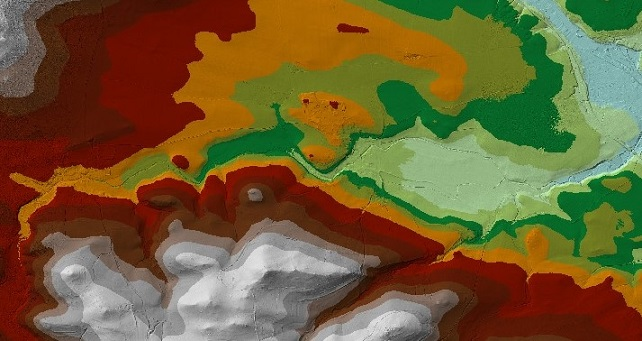
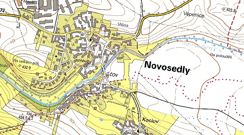
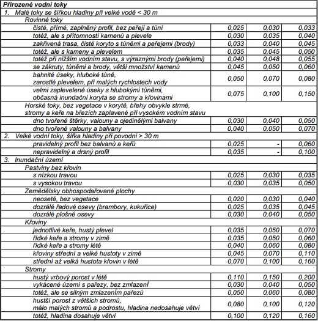

<br>

# Sestavení 1D modelu pro ustálené proudění na úseku Novosedelského potoka

# 1. HEC-RAS
- nejrozšířenější volně dostupný software, [download](http://www.hec.usace.army.mil/software/hec-ras/downloads.aspx)
- slouží k 1D, 2D i 3D simulaci proudění povrchové vody
- ustálené a neustálené proudění, transport sedimentů, analýza kvality a teploty vody
- modelování celé oblasti nebo jen vybraného úseku
- pro výpočet je nutné zahrnout i překážky na toku (jezy, mosty,...)

## 1.1 1D model
- založen na znalosti příčných profilů
- v každém profilu definovaná hladina a sřední průřezová rychlost
- výhody: malé nároky na vstupní data, jednoduché a rychlé výpočty
- nevýhody: nelze modelovat složitější toky, nevhodné pro rozsáhlejší inundační území

<br>

# 2. Zájmové území

```{r, echo = FALSE,message=FALSE,warning=FALSE}
library(leaflet)
library(data.table)
library(rgdal)

locations = data.table(lat = c(13.8331408,13.7590475),lng = c(49.2686678,49.2509808),labels = c("P01 (ř.km 0,030)","P52 (ř.km 7,431)"))

krovak = "+init=epsg:5513"
wgs84 = "+init=epsg:4326"

tok <- readOGR("docs/data/Tok.shp", layer = "Tok")

tok@proj4string = CRS(krovak)
tok_wgs = spTransform(tok,CRS(wgs84))

m <- leaflet(data = tok_wgs) %>%
  addTiles() %>%
  addMarkers(locations$lat, locations$lng, popup=locations$labels) %>%
  addPolylines(color = "blue", popup="Vybraný úsek Novosedelského potoka")
m  # Print the map

```

<br>

# 3. Potřebná data k sestavení 1D modelu

## 3.1 Topografická data
### 3.1.1 DMR 5G
- získané od ČÚZK
- diskrétní body o známých souřadnicích a nadmořské výšce (formát .xyz)
- převod do TIN vrstvy



#### Obr. 1 Vytvořená vrstva TIN
<br>

### 3.1.2 Příčné profily a objekty na toku
- získané od Povodí Vltavy
- 52 profilů (včetně profilů na začátku a konci úseku) + 18 profilů objektů na toku

```{r, echo = FALSE,message=FALSE,warning=FALSE}
library(data.table)
library(plotly)

staniceni = c(-78.00+90,-68.51+90,-59.00+90,-45.80+90,-29.33+90,-11.03+90,-4.79+90,-3.99+90,-3.48+90,0+90,1.73+90,3.63+90,4.17+90,6.42+90,18.59+90,23.65+90,23.65+90)
nadmorska_vyska = c(438.89,434.45,434.1,434.21,433.71,434.13,433.88,433.04,432.63,432.77,432.64,432.70,433.04,434.07,434.23,435.2,436.2)

hx52 = c(-3.99+90,4.17+90)
hy52 = c(433.04,433.04)

P52 = data.table(staniceni,nadmorska_vyska)

plot_ly(P52,x = ~staniceni,linetype="l", color = I("black"))%>%
  add_trace(x = hx52,y = hy52,name="hladina",color=I("blue"),mode="lines")%>%
  add_trace(y = ~nadmorska_vyska,name="profil",color = I("black"))


```

#### Obr. 2 Příčný profil P52 (ř.km 7,431)
<br>

```{r,echo=FALSE,message=FALSE,warning=FALSE}
library(data.table)
library(plotly)
staniceni = c(23.14,23.14,26.63,27.22,32.27,36.87,37.40,40.91,40.91,23.14)
nadmorska_vyska = c(401.26,400.18,398.16,397.42,397.12,397.42,398.22,400.25,401.30,401.26)
ox2 = c(26.63,26.63,27.22,32.27,36.87,37.40,37.40,26.63)
oy2 = c(399.91,398.16,397.42,397.12,397.42,398.22,399.94,399.91)

hox = c(27.22,36.87)
hoy = c(397.42,397.42)

O1 = data.table(staniceni,nadmorska_vyska)

plot_ly(O1,x = ~staniceni,linetype="l", color = I("black"))%>%
  add_trace(x=hox,y = hoy,name="hladina",color=I("blue"),mode="lines")%>%
  add_trace(x=ox2,y = oy2,name="propustek",color = I("red"))%>%
  add_trace(y = ~nadmorska_vyska,name="objekt",color = I("black"))

```

#### Obr. 3 Objekt na toku O1 (ř.km 0,134)

<br>

### 3.1.3 Podkladová mapa ZM10
- získaná od ČÚZK
- pouze pro prezentaci výsledků (mapy záplavového území)



#### Obr. 4 Výřez ze základní mapy měřítka 1:10000
<br>

## 3.2 Hydrologická data
- získané od ČHMÚ
- pro okrajové podmínky: horní OP = N-leté průtoky, dolní OP = kritické hloubky (vlastní výpočet)
- N-leté průtoky na soutoku pro kalibraci

```{r, echo = FALSE}
library(data.table)
N = c("Q1","Q2","Q5","Q10","Q20","Q50","Q100")
Qn_zacatek = c(2.3,3.7,6.2,8.6,12,17,21)
Qn_konec = c(2.9,4.8,8.1,12,18,24,27)
data.table(N,Qn_zacatek,Qn_konec)

```
#### Tab. 1 N-leté průtoky na začátku a na konci úseku

<br>

## 3.3 Hydraulická data
- drsnosti získané z tabulek po vlastním průzkumu terénu



#### Obr. 5 Příklad drsností pro koryto a inundační území

<br>
A nyní hurá do psaní diplomky! :)
<br>

# Děkuji za pozornost
