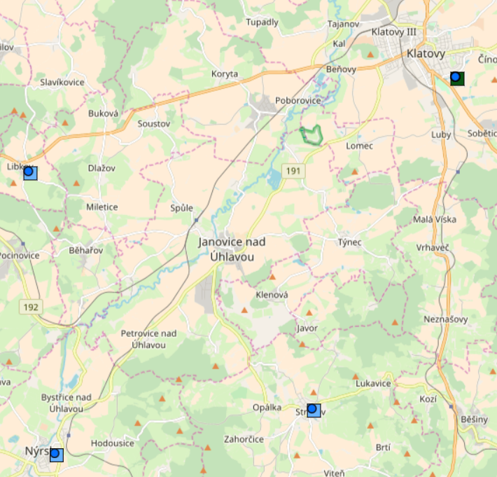
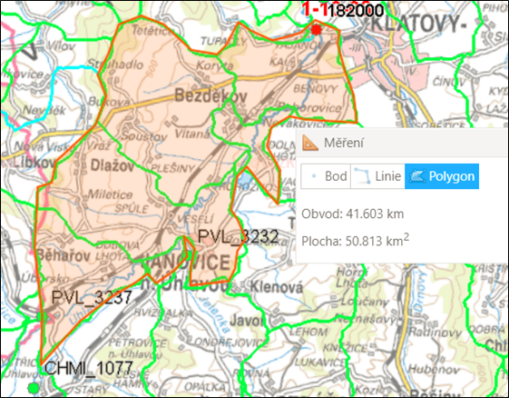
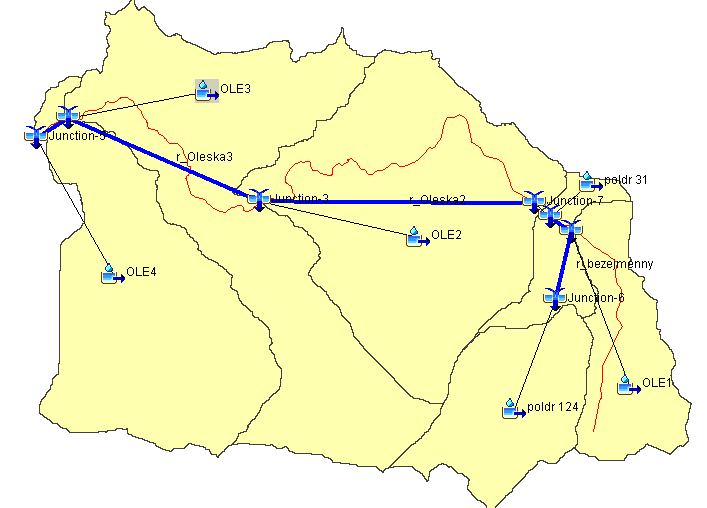

# Využití hydrologického modelu HEC-HMS pro predikci maximálních odtoků z povodí
## Tomáš Mach, ENV,II. ročník
### Obsah
1. Cíle Diplomové práce
2. Získání potřebných dat a jejich vizualizace
3. Popis zájmového území
4. Sestavení Srážko-odtokového modelu v HEC-HMS
5. Závěr - kalibrace, porovnání výsledků


### Diplomová práce
1. Cíle Diplomové práce

* Cílem práce je vytvoření srážko-odtokového modelu v programu HEC-HMS
* Model bude situovám na vyhodnocení extrémních odtoků z povodí, povodňových vln 
* Simulované odtoky z jednotlivých modelů budou kalibrovány na měřené hodnoty ve vodoměrné stanici Tajanov

2. Získání potřebných dat a jejich vizualizace

2.1 Hydrologická data

* Časové řady srážek v hodinovém kroku pro rok 2013 jako vstupy do modelu ze stanic Libkov, Nýrsko, Strážov
* Časové řady průtoků v hodinovém kroku pro rok 2013 jako data potřebná pro kalibraci modelu ze stanice Tajanov
+    Pozn. data budou poskytnuta od ČHMÚ

##### [Zobrazení vodoměrných a srážkoměrných stanic](stanic.html)



2.2 Topologická data

* data od ČÚZK pro vytvoření DMT - Digitálního modelu terénu
* Digitální model reliéfu České republiky 5. generace bude nezbytný jako výchozí podklad pro zpracování DTM v Arcmapu
* DMT 5G představuje zobrazení přirozeného nebo lidskou činností upravenéhozemského povrchu v digitálním tvaru ve formě výšek diskrétních bodů  o souřadnicích X,Y,H, kde H reprezentuje nadmořskou výšku ve výškovém referenčním systému Balt po vyrovnání
* DIBAVOD data, která poskytují mapovou informací o říční síti v ČR, rozvodnicích, jednotlivých povodích


###### Načtení dat
```{r,echo=FALSE,warning=FALSE,message=FALSE}

library(data.table)
setwd("C:/Users/tohon/Desktop/prezentace_ENV_dat")
knitr:: opts_chunk$set(cache.path = getwd())
dta  = read.csv2('data_tm.csv',header = FALSE, sep = ";")

```

###### Pojmenování jednotlivých veličin
```{r,echo=FALSE,warning=FALSE,message=FALSE}
library(data.table)
colnames(dta) = c("Y","M","D","P","E","Q","Tmax","Tmin")


```
```{r,warning=FALSE,message=FALSE}
library(data.table)
head(dta)
```

###### Vytvoření datumů
```{r,echo=FALSE,warning=FALSE,message=FALSE}
library(data.table)
DTM <- seq(from = as.Date(paste(dta$Y[1],
                                dta$M[1],
                                dta$D[1],
                                sep = '-')),
           by = 'day',
           length.out = dim(dta)[1])
dta <- cbind(DTM, dta)

```
```{r,warning=FALSE,message=FALSE}
library(data.table)
head(dta)
```

```{r,echo=FALSE,warning=FALSE,message=FALSE}
library(data.table)
dta$M <- NULL
dta$D <- NULL
colnames(dta) = c("DTM","ID_rok","P","E","Q","Tmax","Tmin")

```
```{r,warning=FALSE,message=FALSE}
library(data.table)
head(dta)
```


###### vytvoření tabulky pro roky 1950 - 1960
```{r, echo=FALSE,warning=FALSE,message=FALSE}
library(data.table)
roky <- c(1950,1951,1952,1953,1954,1955,1956,1957,1958,1959,1960)
dekady <- list()
for(i in 1:length(roky)) {
  dekada <- seq(from = as.Date(paste0(roky[i],'-01-01')),
                by = 'day',
                to = as.Date(paste0(roky[i],'-12-31')))
  dekady[[i]] <- dta[dta$DTM %in% dekada,]
}
dta_dec <- data.table(do.call(rbind, dekady))
```

```{r,warning=FALSE,message=FALSE}
library(data.table)
head(dta_dec)
```


```{r,echo = FALSE,warning=FALSE,message=FALSE}
library(data.table)
rok1950 = dta_dec[which(dta_dec$ID_rok==1950),]
rok1951 = dta_dec[which(dta_dec$ID_rok==1951),]
rok1952 = dta_dec[which(dta_dec$ID_rok==1952),]
rok1953 = dta_dec[which(dta_dec$ID_rok==1953),]
rok1954 = dta_dec[which(dta_dec$ID_rok==1954),]
rok1955 = dta_dec[which(dta_dec$ID_rok==1955),]
rok1956 = dta_dec[which(dta_dec$ID_rok==1956),]
rok1957 = dta_dec[which(dta_dec$ID_rok==1957),]
rok1958 = dta_dec[which(dta_dec$ID_rok==1958),]
rok1959 = dta_dec[which(dta_dec$ID_rok==1959),]
rok1960 = dta_dec[which(dta_dec$ID_rok==1960),]
Q = dta_dec$Q
P = dta_dec$P
DTM = dta_dec$DTM
E = dta_dec$E
ID_rok = dta_dec$ID_rok
Tmax = dta_dec$Tmax
Tmin = dta_dec$Tmin
```

###### Graf zobrazující závislost průtoků Q na čase
```{r,warning=FALSE,message=FALSE}
library(ggplot2)
library(data.table)
library(plotly)
graf_1 = (ggplot(data = dta_dec) + 
  geom_line(aes(x = DTM, y = Q), col = 'green',show.legend = TRUE) +
  labs(x = "Datum",y = "Průtok - Q",title = "Graf pozorovaných veličin")+
  theme(legend.position = "topright")+
scale_color_gradient2())
ggplotly(graf_1)
```

###### Graf zobrazující závislost srážek P na čase
```{r,warning=FALSE,message=FALSE}
library(ggplot2)
library(data.table)
library(plotly)
graf_1 = (ggplot(data = dta_dec) + 
  geom_line(aes(x = DTM, y = P), col = "blue",show.legend = TRUE)+
  labs(x = "Datum",y = "Srážky - P",title = "Graf pozorovaných veličin")+
  theme(legend.position = "topright")+
scale_color_gradient2())
ggplotly(graf_1)
```

###### Graf zobrazující průtoky v čase pro rok 1950-1960 po jednotlivých rocích

```{r,warning=FALSE,message=FALSE}
library(ggplot2)
library(data.table)
library(plotly)
graf_2 = (ggplot(data = dta_dec) + 
  geom_line(aes(x = DTM, y = Q), col = 'green',show.legend = TRUE) +
  labs(x = "Datum",y = "pozorované veličiny",title = "Graf pozorovaných veličin")+
  theme(legend.position = "topright")+
  facet_wrap(~ID_rok,scales = "free")+
scale_color_gradient2())
ggplotly(graf_2)
```

3. Popis zájmového území 

* Řešené území se nachází mezi městy Klatovy a Nýrsko, kterými protéká řeka Úhlava. Povodí Úhlavy je povodí 3. řádu, která dále spadá pod povodí 2. řádu - Berounky a povodí 1. řádu - Vltavy
* Konkrétní řešené území má rozlohu cca 50 km2 a obvod přes 40 km, úzávěrový profil povodí se nachází v místě vodoměrné stanice Tajanov, pro zjištění vstupních dat - srážek bude nezbytné vyhodnotit pomocí ideální metody rozložení srážek ze všech 3 srážkoměrných stanic

##### [Zobrazení povodí zájmového území](uzemi.html)




###### Tabulka popisné statistiky
```{r,echo = FALSE,warning=FALSE,message=FALSE}


tom = data.table(cbind(Roky = c(1950:1960),Q_p = dta_dec[,mean(Q),by = year(DTM)]),P_p = dta_dec[,mean(P),by = year(DTM)],Q_sd = dta_dec[,sd(Q),by = year(DTM)],
P_sd = dta_dec[,sd(P),by = year(DTM)],
Q_max = dta_dec[,max(Q),by = year(DTM)],
P_man = dta_dec[,max(P),by = year(DTM)],
Q_min = dta_dec[,max(Q),by = year(DTM)],
P_min = dta_dec[,max(P),by = year(DTM)])

tom$Q_p.year = NULL
tom$P_p.year = NULL
tom$Q_sd.year = NULL
tom$P_sd.year = NULL
tom$Q_max.year = NULL
tom$P_max.year = NULL
tom$Q_min.year = NULL
tom$P_min.year = NULL
tom$P_man.year = NULL
colnames(tom) = c("roky","Q_průměr","p_průměr","Q_sm_odchylka","P_sm_odchylka","Q_max","P_max","Q_min","P_min")

popis_stat = data.table(tom)

```
```{r,warning=FALSE,message=FALSE}
popis_stat
```


###### Shiny aplikace zobrazující jednotlivé veličiny v závoslisti na čase s mapou jednotlivých stanic
```{r,warning=FALSE,message=FALSE}
library(shiny)
library(ggplot2)
library(data.table)
library(dygraphs)
library(leaflet)

setwd("C:/Users/tohon/Desktop/prezentace_ENV_dat")
data  = read.csv2('data_tm.csv',header = FALSE, sep = ";")


colnames(data) = c("Y","M","D","P","E","Q","Tmax","Tmin")
head(data)


DTM <- seq(from = as.Date(paste(data$Y[1],
                                data$M[1],
                                data$D[1],
                                sep = '-')),
           by = 'day',
           length.out = dim(data)[1])
data <- cbind(DTM, data)
head(data)

data$M <- NULL
data$D <- NULL
colnames(data) = c("DTM","ID_rok","P","E","Q","Tmax","Tmin")
head(data)

roky <- c(1950,1951,1952,1953,1954,1955,1956,1957,1958,1959,1960)
dekady <- list()
for(i in 1:length(roky)) {
  dekada <- seq(from = as.Date(paste0(roky[i],'-01-01')),
                by = 'day',
                to = as.Date(paste0(roky[i],'-12-31')))
  dekady[[i]] <- data[data$DTM %in% dekada,]
}
data_dec <- data.table(do.call(rbind, dekady))
data_dec = data.table(data_dec)
data_dec$ID_rok = as.factor(data_dec$ID_rok)

locations = data.table(
  lng = c(13.13,  13.14,13.24, 13.26 ), lat = c(49.36, 49.29, 49.30,49.40),
  labels = c("Hradiště", "Mětikalov", "Plaveč", "Stříbrné Hory", "Tuchoraz"))

ui <- fluidPage(
  fluidRow(column(4,
      selectInput("variable", "Variable", colnames(data_dec)[!(colnames(data_dec) %in% c("DTM", "ID_rok"))]),
      checkboxGroupInput("catchments", "Catchments:", levels(data_dec$ID_rok), selected = levels(data_dec$ID_rok)[1])),
    column(8,
      plotOutput("plot", click = "plot_click"),
      verbatimTextOutput("plot_clicked_points"))),
  fluidRow(dygraphOutput("dyplot")),
  fluidRow(leafletOutput("map"))
)

server <- function(input, output) {
  data_dec_to_plot <- reactive({
    data_dec[ID_rok %in% input$catchments]
  })
  
  output$map <- renderLeaflet({
    leaflet() %>% setView(lng = 15, lat = 50, zoom = 7) %>% addTiles()  %>% 
      addMarkers(lat = locations$lat, lng =locations$lng, label = locations$labels)
  })    
  
  output$dyplot <- renderDygraph({
    dygraph(dcast(data_dec_to_plot(), "DTM ~ ID_rok", value.var = input$variable)) %>%
      dyRangeSelector()
  })  

  output$plot <- renderPlot({
    return(ggplot(data_dec_to_plot(), aes_string(x = "DTM", y = input$variable, color = "ID_rok"))
      + geom_line() + scale_colour_brewer(palette = "Set1"))
  })  
  
  output$plot_clicked_points <- renderPrint({
    nearPoints(data_dec_to_plot(), input$plot_click)
  })  
}

shinyApp(ui = ui, server = server)

```

4. Sestavení Srážko-odtokového modelu v HEC-HMS

* Srážkoodtokový model popisuje řešené území pomocí schematizace v podobě jeho rozdělení na dílčí povodí a zadání jejich parametrů.
*Software HEC-HMS umožňuje řešené území rozdělit na dílčí povodí („Subbasin“) vzájemně propojená úseky vodních toků vodních toků („Reach“) a jejich soutoků („Junction“).
* Dílčí povodí mají určité vstupní hodnoty - Plocha povodí, úhrn efektivní srážky, transformaci ef. srážky  - jednotkový hydrogram, základní odtok
* Úseky vodních toků - mezi parametry zadávané do výpočtu patří tvar koryta, drsnost koryta dle Manninga, délka a sklon úseku toku - určení pomocí nástrojů ARCGIS, drsnost - místní šetření

##### [Zobrazení povodí zájmového území](model.html)



5. Závěr - kalibrace, porovnání výsledků

* Na závěr je třeba vyhodnotit, který z modelů se nejvíce přibližuje měřeným datům, konkrétně v tomto případě průtokům. Je proto třeba provést určitou optimalizaci parametrů modelu - kalibraci a dojít k požadovanému výsledků.


